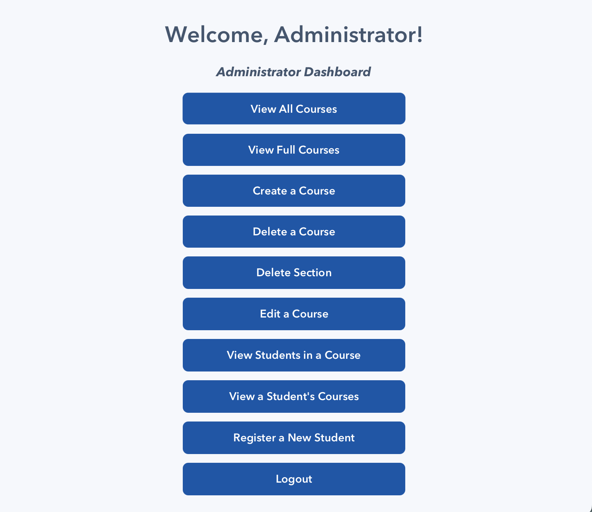
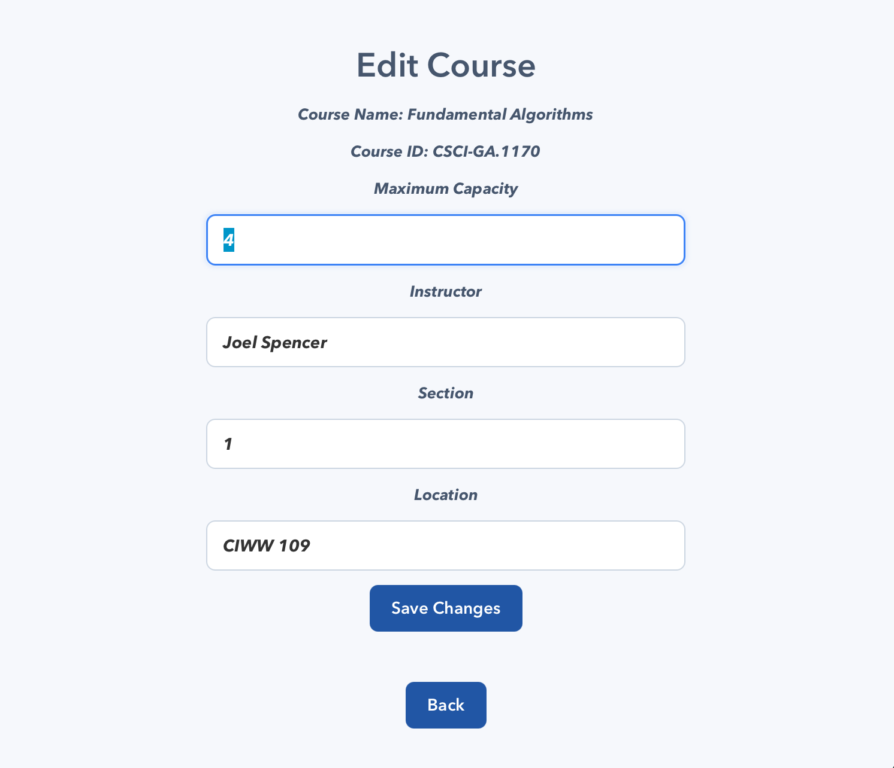

# Course Registration System

A JavaFX desktop application that supports course enrollment and course administration through separate student and administrator workflows.

I originally built this project as a Java object-oriented programming exercise, then redesigned it as a JavaFX desktop application to create a more usable course-registration experience.

## Features

### Student workflow

- Log in as a student
- Browse all available courses
- View courses with open seats
- Register for a course
- Withdraw from an enrolled course
- View a personal course schedule

### Administrator workflow

- View all courses and full courses
- Create, edit, and delete courses or individual sections
- Register new students
- View students enrolled in a course
- View the courses assigned to a specific student

## Technical Highlights

- Java 21
- JavaFX desktop UI
- Maven dependency and build management
- Object-oriented domain model using `User`, `Student`, `Admin`, and `Course`
- Local persistence through serialization
- Shared JavaFX CSS design system for consistent buttons, fields, cards, scroll areas, and dashboards

## Screenshots

| Welcome Screen | Student Dashboard |
| --- | --- |
|  |  |

| Administrator Dashboard | Course Registration |
| --- | --- |
|  |  |

| Course Management |
| --- |
|  |

## Getting Started

### Prerequisites

- Java 21 or later
- Maven
- Eclipse IDE for Java Developers (optional)

### Run with Maven

```bash
mvn clean javafx:run
```

### Run in Eclipse

1. Import the project as an **Existing Maven Project**.
2. Confirm Eclipse uses Java 21.
3. Right-click the project and choose **Run As → Maven build…**.
4. Enter `javafx:run` as the Maven goal.

## Demo Administrator Account

```text
Username: Admin
Password: Admin001
```
Use this to create and register all student accounts to login to the student workflow 

## Project Structure

```text
src/main/java/registrationProgram/    Application and domain classes
src/main/resources/                   Course data and UI stylesheet
src/main/resources/registrationProgram/app.css
                                     Shared JavaFX visual system
```

## Future Improvements

- Replace demo authentication with securely stored credentials
- Add automated unit tests
- Separate UI screens into FXML views and controller classes
- Add searchable/filterable course lists
- Package the application as a native desktop installer

## Author

**Alice Torén**  
Computer Science Student  
[GitHub](https://github.com/alicetoren)
